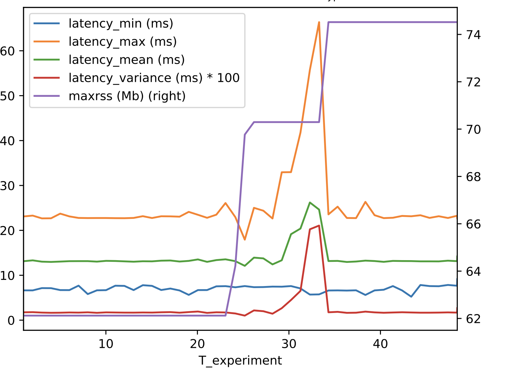

# CPU Abuse Attack
This attack demonstrates a node that consumes all of the compute resources.

Attack node name: `resources_cpu`


## Validation
This validation was run on an a1.xlarge EC2 instance with 4vCPUs and 8GB of memory running Ubuntu18.04. 


Setup the ApexAI performance testing tool, available [here](https://github.com/ApexAI/performance_test).

Run with
```
ros2 run performance_test perf_test -c ROS2 -l log -t Array2m -r 0 --max_runtime 200
```

Launch the attack:
```
ros2 run ros_sec_test ros_sec_test __params:=<path_to_params.yaml>
```

This leads to a graph like below:


The attack is launched 25 seconds into the experiment and spawns threads until 100% cpu is consumed.
The latency increases from about 24 ms up to a peak around 70 ms before the attack ends and the
latency returns to normal.


## Mitigation
TODO
